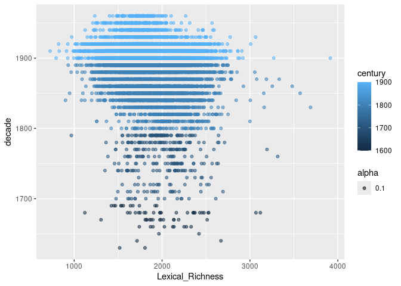
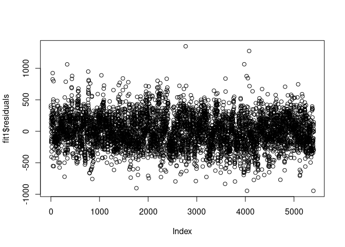
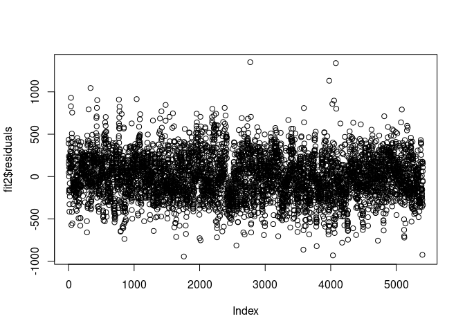
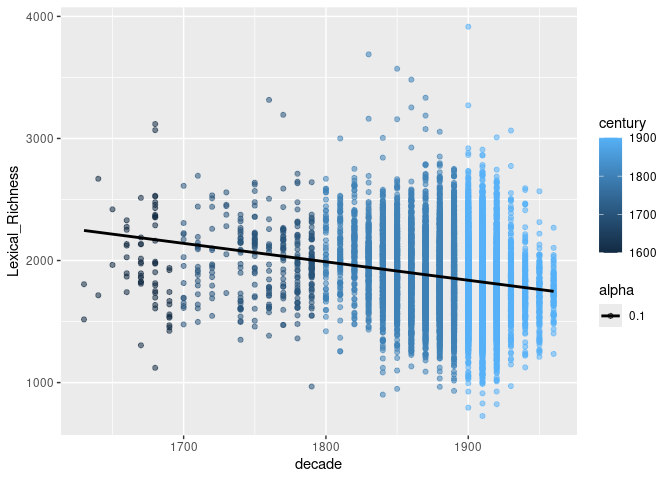

Lexical Richness Over The 17-20th Centuries
================
by Sarah Winne

``` r
library(tidyverse)
library(tidymodels)
library(broom)
```

## Scratch Work

    ## Rows: 13493 Columns: 25
    ## ── Column specification ────────────────────────────────────────────────────────
    ## Delimiter: ","
    ## chr  (8): Work_ID, Literature_Form, Gender, Parenthood, Highest_Education, B...
    ## dbl  (5): Biodiversity_Richness, Lexical_Richness, Age_Publication, Year_Pub...
    ## lgl (12): genre_satire, genre_historical, genre_social, genre_children, genr...
    ## 
    ## ℹ Use `spec()` to retrieve the full column specification for this data.
    ## ℹ Specify the column types or set `show_col_types = FALSE` to quiet this message.

``` r
gutenberg <- gutenberg %>%
  mutate("century" = (floor(Year_Publication/100)*100)) %>%
  mutate("decade" = (floor(Year_Publication/10)*10))
```

``` r
gutenberg %>%
  ggplot(mapping = aes(x = Lexical_Richness, y = decade, color = century, alpha = .1)) +
  geom_point()
```

<!-- -->

``` r
fit1 <- lm(Lexical_Richness ~ Literature_Form + Parenthood + decade, data = gutenberg)
summary(fit1)
```

    ## 
    ## Call:
    ## lm(formula = Lexical_Richness ~ Literature_Form + Parenthood + 
    ##     decade, data = gutenberg)
    ## 
    ## Residuals:
    ##     Min      1Q  Median      3Q     Max 
    ## -946.18 -169.76   -2.76  169.12 1350.22 
    ## 
    ## Coefficients:
    ##                                     Estimate Std. Error t value Pr(>|t|)    
    ## (Intercept)                        3961.7420   165.2190  23.979  < 2e-16 ***
    ## Literature_Formepic_art_novel       240.9058    18.8785  12.761  < 2e-16 ***
    ## Literature_Formepic_art_novella     209.8074    27.1948   7.715 1.43e-14 ***
    ## Literature_Formepic_art_shortstory  266.1265    21.4768  12.391  < 2e-16 ***
    ## Literature_Formepic_art_tale        178.1307    39.4831   4.512 6.57e-06 ***
    ## Literature_Formlyric_art            592.4421    23.2127  25.522  < 2e-16 ***
    ## Literature_Formnonfiction           538.5902    22.1895  24.272  < 2e-16 ***
    ## Parenthoodhas_no_children           -17.3904     9.6811  -1.796   0.0725 .  
    ## decade                               -1.2611     0.0891 -14.154  < 2e-16 ***
    ## ---
    ## Signif. codes:  0 '***' 0.001 '**' 0.01 '*' 0.05 '.' 0.1 ' ' 1
    ## 
    ## Residual standard error: 253.3 on 5398 degrees of freedom
    ##   (8086 observations deleted due to missingness)
    ## Multiple R-squared:  0.2165, Adjusted R-squared:  0.2153 
    ## F-statistic: 186.4 on 8 and 5398 DF,  p-value: < 2.2e-16

``` r
fit2 <- lm(Lexical_Richness ~ Literature_Form + Parenthood + century, data = gutenberg)
summary(fit2)
```

    ## 
    ## Call:
    ## lm(formula = Lexical_Richness ~ Literature_Form + Parenthood + 
    ##     century, data = gutenberg)
    ## 
    ## Residuals:
    ##     Min      1Q  Median      3Q     Max 
    ## -942.73 -171.79   -4.27  166.97 1349.38 
    ## 
    ## Coefficients:
    ##                                      Estimate Std. Error t value Pr(>|t|)    
    ## (Intercept)                        2905.57215  110.31418  26.339  < 2e-16 ***
    ## Literature_Formepic_art_novel       215.74537   18.74766  11.508  < 2e-16 ***
    ## Literature_Formepic_art_novella     181.53291   27.18017   6.679 2.65e-11 ***
    ## Literature_Formepic_art_shortstory  239.37791   21.35567  11.209  < 2e-16 ***
    ## Literature_Formepic_art_tale        170.96659   39.71440   4.305 1.70e-05 ***
    ## Literature_Formlyric_art            583.09539   23.32375  25.000  < 2e-16 ***
    ## Literature_Formnonfiction           516.97452   22.16977  23.319  < 2e-16 ***
    ## Parenthoodhas_no_children           -12.95903    9.72152  -1.333    0.183    
    ## century                              -0.70372    0.06037 -11.657  < 2e-16 ***
    ## ---
    ## Signif. codes:  0 '***' 0.001 '**' 0.01 '*' 0.05 '.' 0.1 ' ' 1
    ## 
    ## Residual standard error: 254.7 on 5398 degrees of freedom
    ##   (8086 observations deleted due to missingness)
    ## Multiple R-squared:  0.2073, Adjusted R-squared:  0.2062 
    ## F-statistic: 176.5 on 8 and 5398 DF,  p-value: < 2.2e-16

``` r
plot(fit1$residuals)
```

<!-- -->

``` r
plot(fit2$residuals)
```

<!-- -->

``` r
gutenberg %>%
  ggplot(mapping = aes(y = Lexical_Richness, x = decade, color = century, alpha = .1)) +
  geom_point() +
  geom_smooth(color = "black", method = "lm", se = FALSE) 
```

    ## `geom_smooth()` using formula = 'y ~ x'

<!-- -->
