Lexical Richness Over The 17th-20th Centuries - Plots
================
by Sarah Winne

``` r
library(tidyverse)
library(tidymodels)
library(broom)
```

## Scratch Work

    ## Rows: 13493 Columns: 25
    ## ── Column specification ────────────────────────────────────────────────────────
    ## Delimiter: ","
    ## chr  (8): Work_ID, Literature_Form, Gender, Parenthood, Highest_Education, B...
    ## dbl  (5): Biodiversity_Richness, Lexical_Richness, Age_Publication, Year_Pub...
    ## lgl (12): genre_satire, genre_historical, genre_social, genre_children, genr...
    ## 
    ## ℹ Use `spec()` to retrieve the full column specification for this data.
    ## ℹ Specify the column types or set `show_col_types = FALSE` to quiet this message.

``` r
gutenberg <- gutenberg %>%
  mutate("century" = (floor(Year_Publication/100)*100)) %>%
  mutate("decade" = (floor(Year_Publication/10)*10)) %>%
  mutate("age_by10" = (floor(Age_Publication/10)*10))
```

``` r
gutenberg %>%
  ggplot(mapping = aes(x = Lexical_Richness, y = decade, color = century, alpha = .1)) +
  geom_point()
```

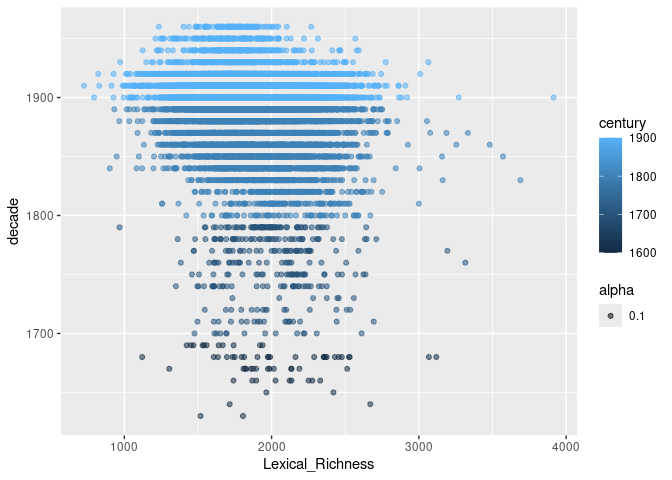<!-- -->

``` r
gutenberg %>%
  ggplot(mapping = aes(y = Lexical_Richness, x = decade, color = century, alpha = .1)) +
  geom_point() +
  geom_smooth(color = "black", method = "lm", se = FALSE) 
```

    ## `geom_smooth()` using formula = 'y ~ x'

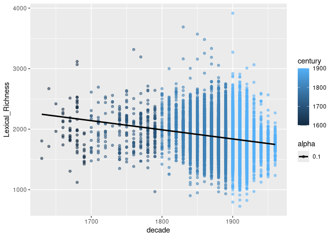<!-- -->

``` r
gutenberg %>%
  ggplot(mapping = aes(y = Lexical_Richness, x = decade, color = century, alpha = .1)) +
  geom_point() +
  geom_smooth(color = "black", method = "lm", se = FALSE) +
  facet_wrap(~ age_by10)
```

    ## `geom_smooth()` using formula = 'y ~ x'

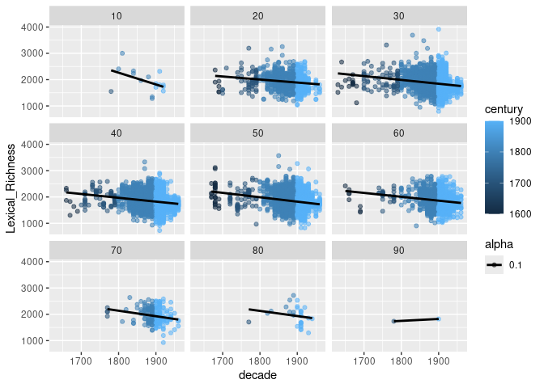<!-- -->

``` r
gutenberg %>%
  ggplot(mapping = aes(y = Lexical_Richness, x = Year_Publication, color = century, alpha = .1)) +
  geom_point() +
  geom_smooth(color = "black", method = "lm", se = FALSE)
```

    ## `geom_smooth()` using formula = 'y ~ x'

<!-- -->

``` r
gutenberg %>%
  mutate(Year_Publication = if_else(Year_Publication>=1800, Year_Publication, NA)) %>%
  ggplot(mapping = aes(y = Lexical_Richness, x = Year_Publication, color = century, alpha = .1)) +
  geom_point() +
  geom_smooth(color = "black", method = "lm", se = FALSE)
```

    ## `geom_smooth()` using formula = 'y ~ x'

    ## Warning: Removed 370 rows containing non-finite outside the scale range
    ## (`stat_smooth()`).

    ## Warning: Removed 370 rows containing missing values or values outside the scale range
    ## (`geom_point()`).

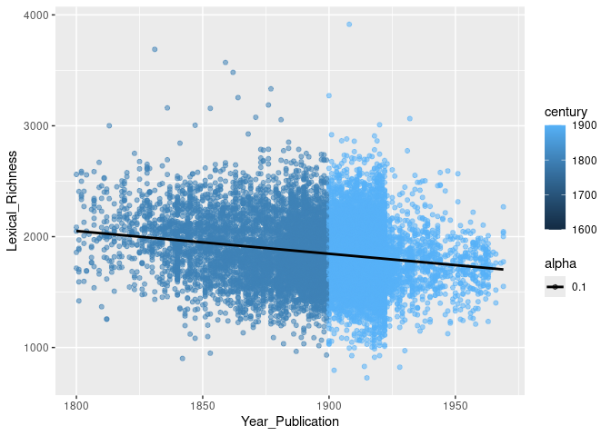<!-- -->

``` r
gutenberg %>%
  mutate(Year_Publication = if_else(Year_Publication<=1800, Year_Publication, NA)) %>%
  ggplot(mapping = aes(y = Lexical_Richness, x = Year_Publication, color = century, alpha = .1)) +
  geom_point() +
  geom_smooth(color = "black", method = "lm", se = FALSE)
```

    ## `geom_smooth()` using formula = 'y ~ x'

    ## Warning: Removed 13118 rows containing non-finite outside the scale range
    ## (`stat_smooth()`).

    ## Warning: Removed 13118 rows containing missing values or values outside the scale range
    ## (`geom_point()`).

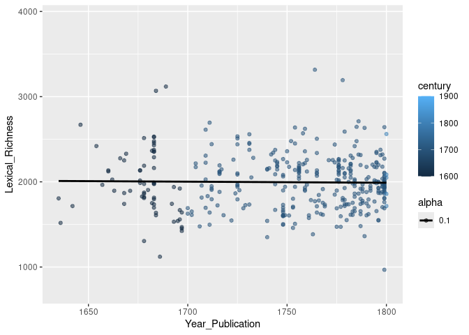<!-- -->

``` r
gutenberg %>%
  mutate(Year_Publication = if_else(Year_Publication<=1800, Year_Publication, NA)) %>%
  ggplot(mapping = aes(x = as_factor(century))) +
  geom_bar()
```

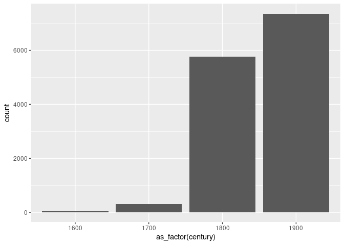<!-- -->

``` r
gutenberg %>%
  ggplot(mapping = aes(y = Lexical_Richness, x = Year_Publication, color = century, alpha = .1)) +
  geom_point() +
  geom_smooth(color = "black", se = FALSE)
```

    ## `geom_smooth()` using method = 'gam' and formula = 'y ~ s(x, bs = "cs")'

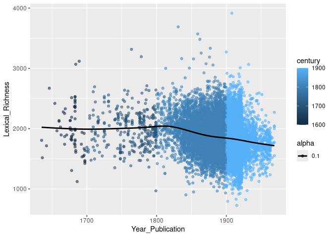<!-- -->

``` r
gutenberg %>%
  ggplot(mapping = aes(x = Lexical_Richness, y = Literature_Form, color = century, alpha = .1)) +
  geom_jitter()
```

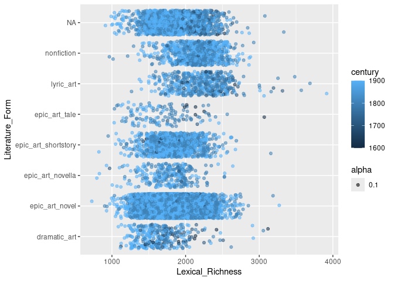<!-- -->

``` r
gutenberg %>%
  ggplot(mapping = aes(x = Lexical_Richness, y = Literature_Form, fill = century)) +
  geom_bar(stat = "identity")
```

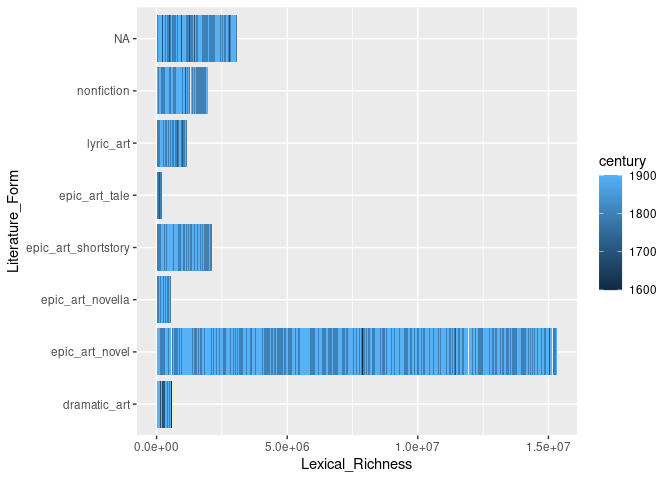<!-- -->

``` r
gutenberg %>%
  ggplot(mapping = aes(y = Lexical_Richness, x = Year_Publication, color = century, alpha = .1)) +
  geom_point() +
  geom_smooth(color = "black", se = FALSE) +
  facet_wrap(~Highest_Education)
```

    ## `geom_smooth()` using method = 'gam' and formula = 'y ~ s(x, bs = "cs")'

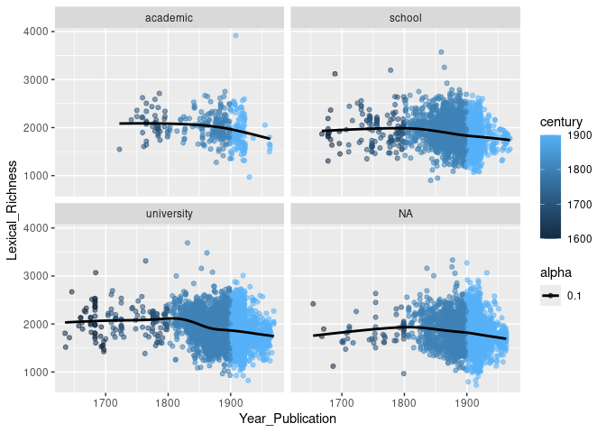<!-- -->

``` r
gutenberg %>%
  ggplot(mapping = aes(x = Lexical_Richness, y = decade, color = century, alpha = .1)) +
  geom_point() +
  geom_smooth(color = "black", method = "lm", se = FALSE) +
  facet_wrap(~ Parenthood)
```

    ## `geom_smooth()` using formula = 'y ~ x'

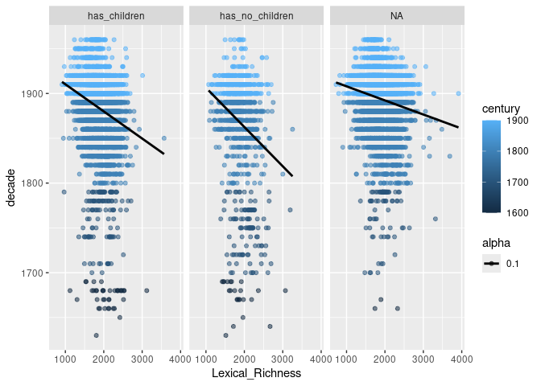<!-- -->

``` r
gutenberg %>%
  ggplot(mapping = aes(y = Lexical_Richness, x = decade, group = century, alpha = 0.1)) +
  geom_boxplot()
```

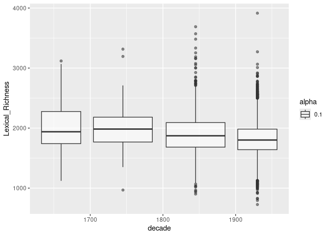<!-- -->
