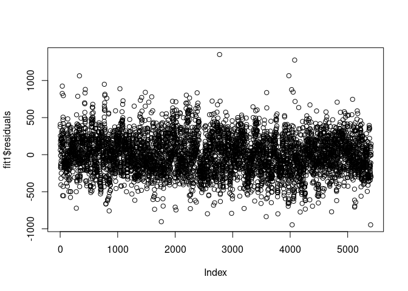
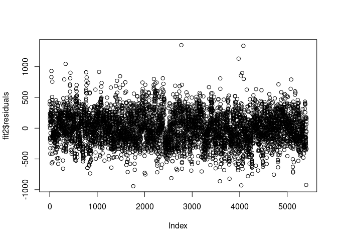

Lexical Richness Over The 17th-20th Centuries - Stats
================
by Sarah Winne

``` r
library(tidyverse)
library(tidymodels)
library(broom)
```

## Scratch Work

    ## Rows: 13493 Columns: 25
    ## ── Column specification ────────────────────────────────────────────────────────
    ## Delimiter: ","
    ## chr  (8): Work_ID, Literature_Form, Gender, Parenthood, Highest_Education, B...
    ## dbl  (5): Biodiversity_Richness, Lexical_Richness, Age_Publication, Year_Pub...
    ## lgl (12): genre_satire, genre_historical, genre_social, genre_children, genr...
    ## 
    ## ℹ Use `spec()` to retrieve the full column specification for this data.
    ## ℹ Specify the column types or set `show_col_types = FALSE` to quiet this message.

    ##    Work_ID          Biodiversity_Richness Lexical_Richness Age_Publication
    ##  Length:13493       Min.   :  0.45        Min.   : 726.3   Min.   :13.00  
    ##  Class :character   1st Qu.:  8.42        1st Qu.:1659.8   1st Qu.:36.00  
    ##  Mode  :character   Median : 12.39        Median :1834.4   Median :44.00  
    ##                     Mean   : 14.27        Mean   :1855.9   Mean   :44.79  
    ##                     3rd Qu.: 17.88        3rd Qu.:2038.2   3rd Qu.:52.00  
    ##                     Max.   :113.39        Max.   :3915.2   Max.   :91.00  
    ##                                                                           
    ##  Year_Publication Literature_Form       Gender           Parenthood       
    ##  Min.   :1635     Length:13493       Length:13493       Length:13493      
    ##  1st Qu.:1881     Class :character   Class :character   Class :character  
    ##  Median :1902     Mode  :character   Mode  :character   Mode  :character  
    ##  Mean   :1893                                                             
    ##  3rd Qu.:1915                                                             
    ##  Max.   :1969                                                             
    ##                                                                           
    ##  Highest_Education  Biodiversity_Background Main_Region          Migrating    
    ##  Length:13493       Length:13493            Length:13493       Min.   :1.000  
    ##  Class :character   Class :character        Class :character   1st Qu.:1.000  
    ##  Mode  :character   Mode  :character        Mode  :character   Median :1.000  
    ##                                                                Mean   :1.424  
    ##                                                                3rd Qu.:2.000  
    ##                                                                Max.   :6.000  
    ##                                                                NA's   :1185   
    ##  Main_Residence     genre_satire    genre_historical genre_social   
    ##  Length:13493       Mode :logical   Mode :logical    Mode :logical  
    ##  Class :character   FALSE:13137     FALSE:10560      FALSE:7611     
    ##  Mode  :character   TRUE :356       TRUE :2933       TRUE :5882     
    ##                                                                     
    ##                                                                     
    ##                                                                     
    ##                                                                     
    ##  genre_children  genre_adventure genre_mystery   genre_crime    
    ##  Mode :logical   Mode :logical   Mode :logical   Mode :logical  
    ##  FALSE:11177     FALSE:11990     FALSE:12383     FALSE:12793    
    ##  TRUE :2316      TRUE :1503      TRUE :1110      TRUE :700      
    ##                                                                 
    ##                                                                 
    ##                                                                 
    ##                                                                 
    ##   genre_sf       genre_romance   genre_fantasy   genre_biography
    ##  Mode :logical   Mode :logical   Mode :logical   Mode :logical  
    ##  FALSE:13136     FALSE:12237     FALSE:12982     FALSE:13394    
    ##  TRUE :357       TRUE :1256      TRUE :511       TRUE :99       
    ##                                                                 
    ##                                                                 
    ##                                                                 
    ##                                                                 
    ##  genre_travellogue
    ##  Mode :logical    
    ##  FALSE:13468      
    ##  TRUE :25         
    ##                   
    ##                   
    ##                   
    ## 

``` r
gutenberg <- gutenberg %>%
  mutate("century" = (floor(Year_Publication/100)*100)) %>%
  mutate("decade" = (floor(Year_Publication/10)*10)) %>%
  mutate("age_by10" = (floor(Age_Publication/10)*10))
```

``` r
fit1 <- lm(Lexical_Richness ~ Literature_Form + Parenthood + decade, data = gutenberg)
summary(fit1)
```

    ## 
    ## Call:
    ## lm(formula = Lexical_Richness ~ Literature_Form + Parenthood + 
    ##     decade, data = gutenberg)
    ## 
    ## Residuals:
    ##     Min      1Q  Median      3Q     Max 
    ## -946.18 -169.76   -2.76  169.12 1350.22 
    ## 
    ## Coefficients:
    ##                                     Estimate Std. Error t value Pr(>|t|)    
    ## (Intercept)                        3961.7420   165.2190  23.979  < 2e-16 ***
    ## Literature_Formepic_art_novel       240.9058    18.8785  12.761  < 2e-16 ***
    ## Literature_Formepic_art_novella     209.8074    27.1948   7.715 1.43e-14 ***
    ## Literature_Formepic_art_shortstory  266.1265    21.4768  12.391  < 2e-16 ***
    ## Literature_Formepic_art_tale        178.1307    39.4831   4.512 6.57e-06 ***
    ## Literature_Formlyric_art            592.4421    23.2127  25.522  < 2e-16 ***
    ## Literature_Formnonfiction           538.5902    22.1895  24.272  < 2e-16 ***
    ## Parenthoodhas_no_children           -17.3904     9.6811  -1.796   0.0725 .  
    ## decade                               -1.2611     0.0891 -14.154  < 2e-16 ***
    ## ---
    ## Signif. codes:  0 '***' 0.001 '**' 0.01 '*' 0.05 '.' 0.1 ' ' 1
    ## 
    ## Residual standard error: 253.3 on 5398 degrees of freedom
    ##   (8086 observations deleted due to missingness)
    ## Multiple R-squared:  0.2165, Adjusted R-squared:  0.2153 
    ## F-statistic: 186.4 on 8 and 5398 DF,  p-value: < 2.2e-16

``` r
fit2 <- lm(Lexical_Richness ~ Literature_Form + Parenthood + century, data = gutenberg)
summary(fit2)
```

    ## 
    ## Call:
    ## lm(formula = Lexical_Richness ~ Literature_Form + Parenthood + 
    ##     century, data = gutenberg)
    ## 
    ## Residuals:
    ##     Min      1Q  Median      3Q     Max 
    ## -942.73 -171.79   -4.27  166.97 1349.38 
    ## 
    ## Coefficients:
    ##                                      Estimate Std. Error t value Pr(>|t|)    
    ## (Intercept)                        2905.57215  110.31418  26.339  < 2e-16 ***
    ## Literature_Formepic_art_novel       215.74537   18.74766  11.508  < 2e-16 ***
    ## Literature_Formepic_art_novella     181.53291   27.18017   6.679 2.65e-11 ***
    ## Literature_Formepic_art_shortstory  239.37791   21.35567  11.209  < 2e-16 ***
    ## Literature_Formepic_art_tale        170.96659   39.71440   4.305 1.70e-05 ***
    ## Literature_Formlyric_art            583.09539   23.32375  25.000  < 2e-16 ***
    ## Literature_Formnonfiction           516.97452   22.16977  23.319  < 2e-16 ***
    ## Parenthoodhas_no_children           -12.95903    9.72152  -1.333    0.183    
    ## century                              -0.70372    0.06037 -11.657  < 2e-16 ***
    ## ---
    ## Signif. codes:  0 '***' 0.001 '**' 0.01 '*' 0.05 '.' 0.1 ' ' 1
    ## 
    ## Residual standard error: 254.7 on 5398 degrees of freedom
    ##   (8086 observations deleted due to missingness)
    ## Multiple R-squared:  0.2073, Adjusted R-squared:  0.2062 
    ## F-statistic: 176.5 on 8 and 5398 DF,  p-value: < 2.2e-16

``` r
plot(fit1$residuals)
```

<!-- -->

``` r
plot(fit2$residuals)
```

<!-- -->

``` r
gutenberg17th <- gutenberg %>%
  mutate(century = if_else(century == 1600, century, NA)) %>%
  drop_na(century)
```

``` r
gutenberg18th <- gutenberg %>%
  mutate(century = if_else(century == 1700, century, NA)) %>%
  drop_na(century)
```

``` r
gutenberg19th <- gutenberg %>%
  mutate(century = if_else(century == 1800, century, NA)) %>%
  drop_na(century)
```

``` r
gutenberg20th <- gutenberg %>%
  mutate(century = if_else(century == 1900, century, NA)) %>%
  drop_na(century)
```

``` r
stat <- gutenberg %>%
  summarise(mean = mean(Lexical_Richness), median = median(Lexical_Richness)) 
```

``` r
stats17th <- gutenberg17th %>%
  summarise(mean = mean(Lexical_Richness), median = median(Lexical_Richness)) 
stats18th <- gutenberg18th %>%
  summarise(mean = mean(Lexical_Richness), median = median(Lexical_Richness)) 
stats19th <- gutenberg19th %>%
  summarise(mean = mean(Lexical_Richness), median = median(Lexical_Richness)) 
stats20th <- gutenberg20th %>%
  summarise(mean = mean(Lexical_Richness), median = median(Lexical_Richness)) 
```

``` r
stat
```

    ## # A tibble: 1 × 2
    ##    mean median
    ##   <dbl>  <dbl>
    ## 1 1856.  1834.

``` r
stats17th
```

    ## # A tibble: 1 × 2
    ##    mean median
    ##   <dbl>  <dbl>
    ## 1 1992.   1939

``` r
stats18th
```

    ## # A tibble: 1 × 2
    ##    mean median
    ##   <dbl>  <dbl>
    ## 1 1995.  1984.

``` r
stats19th
```

    ## # A tibble: 1 × 2
    ##    mean median
    ##   <dbl>  <dbl>
    ## 1 1895.  1872.

``` r
stats20th
```

    ## # A tibble: 1 × 2
    ##    mean median
    ##   <dbl>  <dbl>
    ## 1 1818.  1801.
