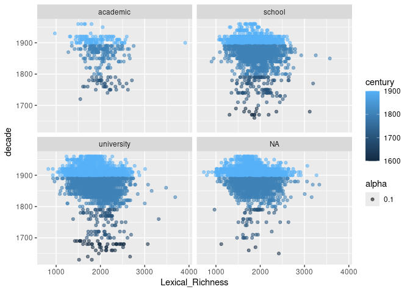
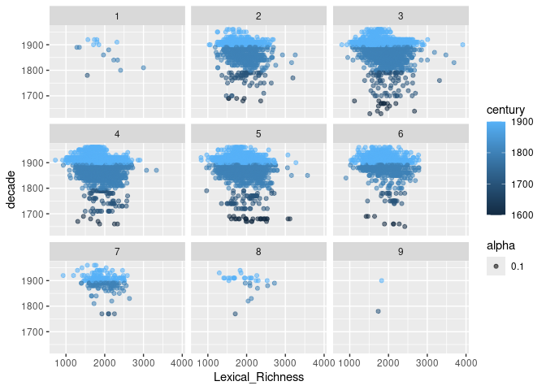

---
output:
  pdf_document: default
  html_document: default
---
Project proposal
================
Sarah Winne

``` r
library(tidyverse)
library(broom)
```

## 1. Introduction

How has the average, maximum, and minimum lexical richness (variety of
vocabulary) changed over time, especially around the 20th century, and
how does the level of education or age of the author have an effect on
the vocabulary used?

The data I’m using to answer this question is “Project Gutenberg
creative literature life circumstance & work metadata
collection”(Langer, Lars; 2023), found in the Harvard Dataverse. Each
case is a unique book found in the Project Gutenberg digital library.
There are 13493 cases in this dataset. The variables are the ID of the
book, how many unique terms for organisms there are in each book
(normalized to 10,000 tokens), the size of the vocabulary of each book,
authors age at publication, the year of publication (or conception, if
earlier), what type of literature the book is, gender of the author,
whether or not the author is a parent, what the authors highest form of
education was, whether the auhtor’s occupation was connected to
biodiversity, where the author lived most of their lives, how many
reigons the author reached in their life, if the author’s main residence
was in a village, town, or city, then booleans for genre tags(satire,
historical, social, children, adventure, mystery, crime, sci-fi,
romance, fantasy, biography, travellogue). This is a total of 25
variables.

## 2. Data

    ## Rows: 13,493
    ## Columns: 25
    ## $ Work_ID                 <chr> "PG52204", "PG37657", "PG44860", "PG35533", "P…
    ## $ Biodiversity_Richness   <dbl> 26.50, 15.52, 14.10, 13.89, 12.62, 13.09, 14.1…
    ## $ Lexical_Richness        <dbl> 2483.93, 2245.41, 2290.33, 1888.27, 1989.59, 2…
    ## $ Age_Publication         <dbl> 36, 40, 36, 55, 37, 54, 48, 50, 36, 54, 55, 68…
    ## $ Year_Publication        <dbl> 1847, 1851, 1847, 1876, 1858, 1875, 1869, 1871…
    ## $ Literature_Form         <chr> NA, "epic_art_novel", "epic_art_novel", "epic_…
    ## $ Gender                  <chr> "gender_m", "gender_m", "gender_m", "gender_f"…
    ## $ Parenthood              <chr> "has_children", "has_children", "has_children"…
    ## $ Highest_Education       <chr> "university", "university", "university", "sch…
    ## $ Biodiversity_Background <chr> "no_bio_inclination", "no_bio_inclination", "n…
    ## $ Main_Region             <chr> "british_isles", "british_isles", "british_isl…
    ## $ Migrating               <dbl> 2, 2, 2, 2, 2, 2, 2, 2, 2, 2, 2, 2, 1, NA, NA,…
    ## $ Main_Residence          <chr> "city", "city", "city", "city", "city", "city"…
    ## $ genre_satire            <lgl> TRUE, TRUE, TRUE, FALSE, FALSE, FALSE, FALSE, …
    ## $ genre_historical        <lgl> FALSE, TRUE, TRUE, FALSE, FALSE, FALSE, TRUE, …
    ## $ genre_social            <lgl> FALSE, FALSE, FALSE, TRUE, FALSE, TRUE, FALSE,…
    ## $ genre_children          <lgl> FALSE, FALSE, FALSE, FALSE, TRUE, FALSE, FALSE…
    ## $ genre_adventure         <lgl> FALSE, FALSE, FALSE, FALSE, FALSE, FALSE, FALS…
    ## $ genre_mystery           <lgl> FALSE, FALSE, FALSE, FALSE, FALSE, FALSE, FALS…
    ## $ genre_crime             <lgl> FALSE, FALSE, FALSE, FALSE, FALSE, FALSE, FALS…
    ## $ genre_sf                <lgl> FALSE, FALSE, FALSE, FALSE, FALSE, FALSE, FALS…
    ## $ genre_romance           <lgl> FALSE, FALSE, FALSE, FALSE, FALSE, FALSE, FALS…
    ## $ genre_fantasy           <lgl> FALSE, FALSE, FALSE, FALSE, FALSE, FALSE, FALS…
    ## $ genre_biography         <lgl> FALSE, FALSE, FALSE, FALSE, FALSE, FALSE, FALS…
    ## $ genre_travellogue       <lgl> FALSE, FALSE, FALSE, FALSE, FALSE, FALSE, FALS…

## 3. Data analysis plan

I will be using the year of publication to predict the lexical richness.

I will likely be comparing by decade, then comparing ages to each other,
and potentially also the author’s highest level of education.

    ## # A tibble: 4 × 2
    ##   century     n
    ##     <dbl> <int>
    ## 1    1600    65
    ## 2    1700   305
    ## 3    1800  5765
    ## 4    1900  7358

Understanding how many publications that are in the Project Gutengerg
collection from each century helps show how there are many more
publications included that are in the 18-1900’s, so my analysis might
focus more where I have an abundance of data.

<!-- -->

Graphing lexical richness against each decade gives a clearer look at
how the general spread of the data is.

<!-- -->

<!-- -->

These two faceted graphs, by the highest education reached and the
author’s age(rounded by decade) respectively, helps highlight a few
outliers within each fascet. For example the point in the academic facet
on the 1900 line, to the far right, showing by far the highest lexical
richness. The second graph shows which ages had the most authors and the
widest spread of lexical richness. It would be interesting to see the
avgerages, but also the maximums and minimums of each age group, and see
if there had been similar or different changes in each age group over
time.

It might be useful to use proportions or densities more, so it’s easier
to see the differences or similarities between facets with a lot of
data, or less data (both in the un-faceted and faceted graphs). Some
more summary statistics about the average, max, and min of each decade
for lexical richness would be useful. Also for the faceted groups.

To support my hypothesis that average lexical richness was decreasing, I
would need to see the average go down over the increasing decades.
